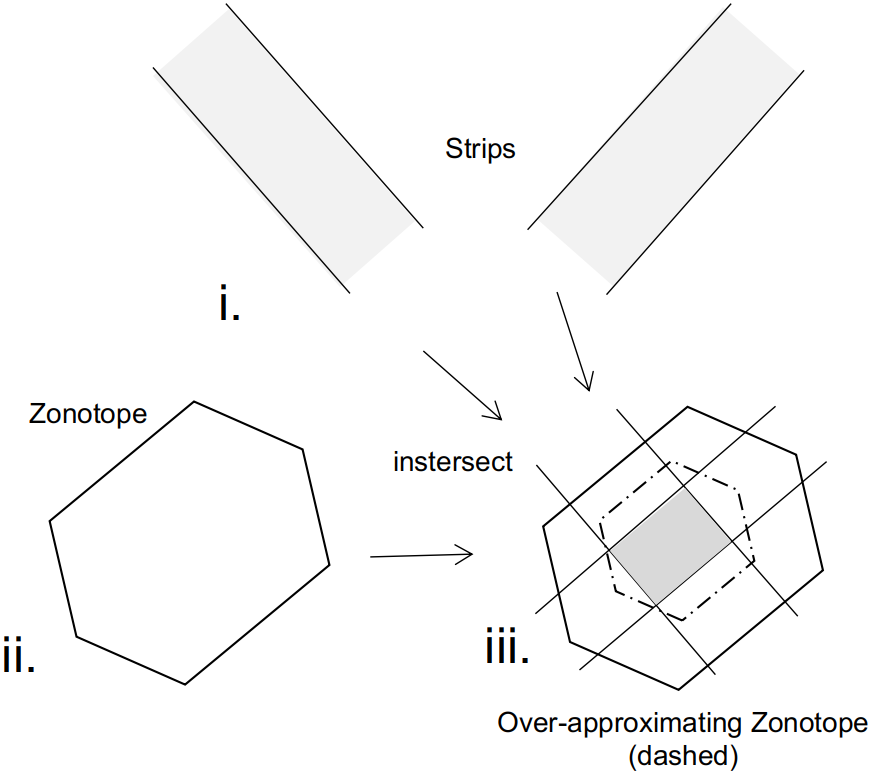
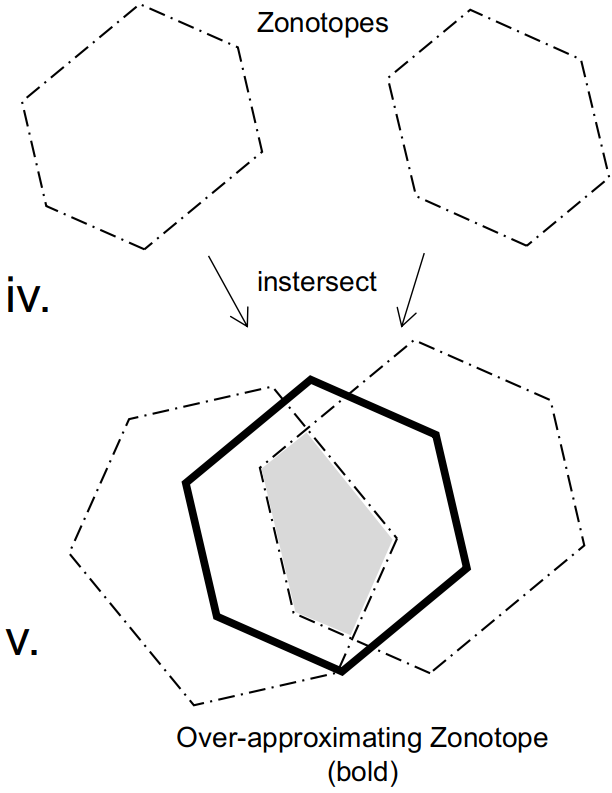
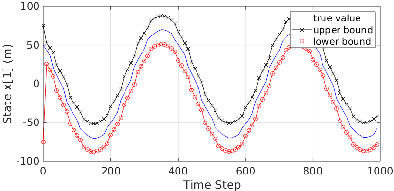
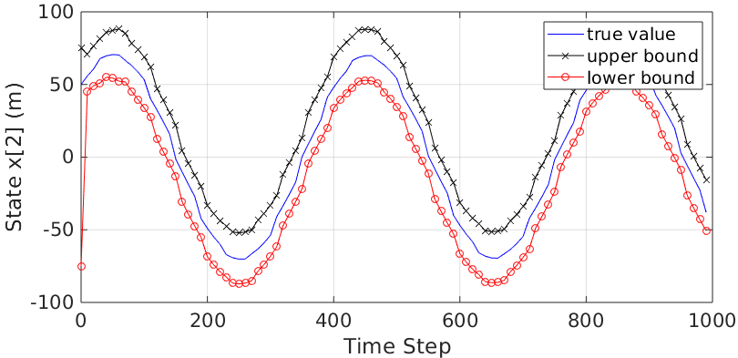

# Distributed-Set-Based-Observers-Using-Diffusion-Strategy

This repo is the code and data used to evaulate our [paper](https://arxiv.org/abs/2003.10347)    
Amr Alanwar, Jagat Jyoti Rath, Hazem Said, and Matthias Althoff "Distributed-Set-Based-Observers-Using-Diffusion-Strategy" 
 
 
 
We propose two distributed set-based observers using  
1- Set-membership approach  
2- Interval-based approach  
 for a linear discrete-time dynamical system with bounded modeling and measurement uncertainties.  
 
 
The Set-membership approach consists of three steps  
a- Measurement update: It consists of overapproximating the intersection between a strips and zonotope which is represented using the following    
 
The main function to intersect strips and a zonotope is "intersectZonoStrip.m" under the "utilities" folder. 
 
b- Diffusion update: It consists of overapproximating the intersection between a multiple zonotopes by a zonotope which is represented using the following   
 
The main function to intersect zonotopes is "andAveraging1.m" under the "utilities" folder
 
c- Time update
 
 
To run the distribted set-based observer on the rotatingTarget.csv file, do the following
1- Open the main file "run_rotatingTarget"   
2- choose which algorithm to be executed at line ~150 algorithm = 'set-membership' or algorithm = 'interval-based'
3- To save the movie, set 
SAVEMOVIE = true; 
at to save the generated movie under the video folder. 
4- This generates mat file (temp by default) under the cache folder.  
5- run "plot_rotatingTarget_state.m" which choosing loading the cache temp at the beggining load('cache/temp'). This plots a figure close to the following figures    
 
 
 
 
 
